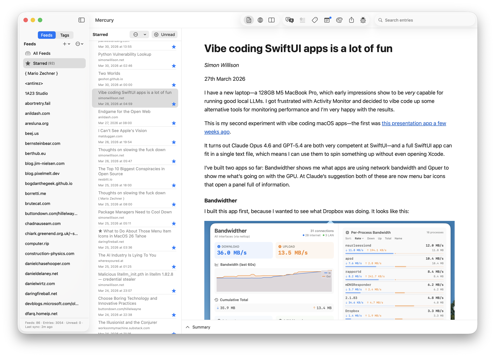
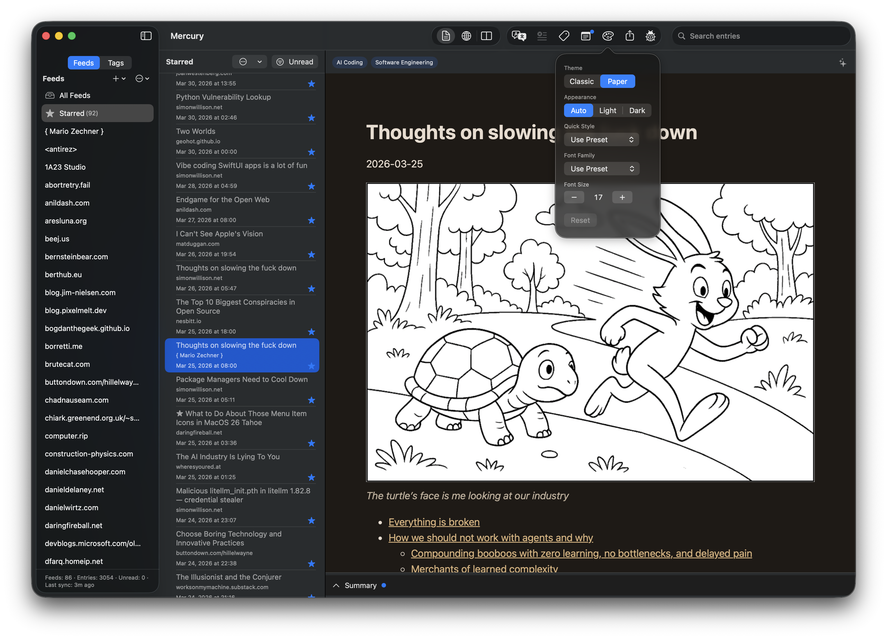
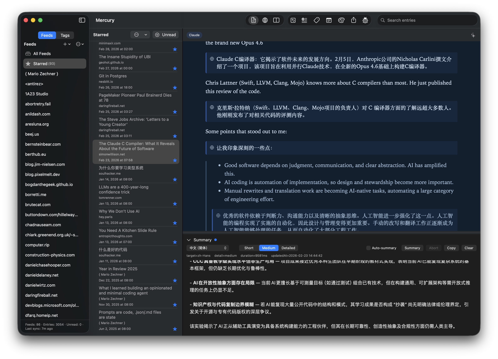
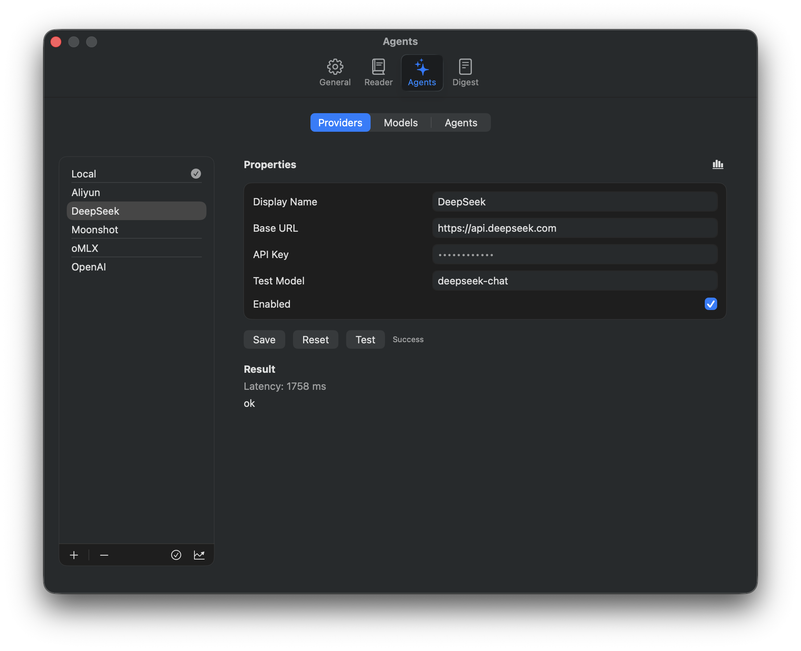

# Mercury

Mercury is a macOS-native, local-first RSS reader focused on comfortable and convenient information aggregation and reading. It boosts your efficiency with highly customizable AI features — article summarization and bilingual translation — powered by any large language model you have access to, whether running locally or as an online service.

Mercury 是一款 macOS 原生、强调本地优先（*local first*）的 RSS 阅读器，专注于方便舒适的信息聚合与阅读体验，并通过高度可定制的 AI 功能（如文章摘要与双语翻译）提升你的效率（使用任何你能访问的大语言模型，无论本地还是在线服务）。

[](https://github.com/neolee/mercury/releases/latest)

[Screens 截图](#screenshots) | [English Readme](#features) | [中文说明](#功能特性)

---

<a id="screenshots"></a>









---

## Features

- **Native macOS experience**: Built with SwiftUI, follows macOS design conventions, supports keyboard-driven workflows
- **Local-first**: No registration, no login, no subscription — Mercury never proactively collects any of your data
- **Multi-format feeds**: Supports RSS, Atom, and JSON Feed; batch import and export via OPML
- **Focused reading**: A clean, distraction-free Reader mode with intelligent content cleaning, customizable themes and fonts
- **UI localization**: Interface available in English and Simplified Chinese, switchable at any time without restarting
- **AI Summary**: Generate article summaries with a single click — specify language and detail level, with custom prompts support
- **AI Translation**: Translate articles into your target language, displayed in a bilingual paragraph-by-paragraph layout, with custom prompts support
- **LLM token usage tracking**: Built-in usage statistics and comparison reports for provider/model/agent dimensions
- **Open, privacy-respecting AI integration**: Compatible with any OpenAI-format API, including locally-run and cloud-based services

### Roadmap

The following features are under development:

- **Tag system**: A new dimension for aggregating content by tag — supports user-defined tags and AI auto-tagging, with filtering by individual tags or tag combinations
- **Multi-article summary (digest)**: Generate aggregate summaries for new articles in a specific feed or tag, to quickly catch up on what matters over a given time period

## Requirements

- macOS 14.6+

To use AI agent features, you also need:

- An OpenAI-compatible API, supporting local or commercial LLM inference services

## Installation

1. Go to the [Releases](https://github.com/neolee/mercury/releases/latest) page and download the latest `.dmg` file
2. Mount the `.dmg` file and drag **Mercury.app** into your Applications folder
3. On first launch, macOS may prompt you about an app downloaded from the internet — click **Open** to proceed (the app is signed with a Developer ID and notarized by Apple)

## Getting Started

### Adding Feeds

- Click the **+** button at the top of the left sidebar, select **Add Feed…**, enter the feed URL, and press Return to add it
- Or select **Import OPML…** and choose your OPML file to import feeds in bulk

### Configuring AI Agents

Mercury's summary and translation features are powered by AI agents. Before use, you need to configure a large language model provider:

1. Open **Mercury → Settings…** or press **command-,**, then switch to the **Agents** tab
2. Click the **+** button at the bottom of the **Providers** list and fill in:
   - **Display Name**: A name for the provider
   - **Base URL**: The OpenAI-compatible API endpoint, e.g. `https://api.deepseek.com`, or for a local model such as `http://localhost:2233/v1` — include everything before the `chat/completions` path, along with the correct port
   - **API Key**: The credential for the provider (any string works for local models). The key is stored only on your machine, securely in macOS `keychain` — it is never uploaded or shared by Mercury in any form
   - Optionally, enter a model name in **Test Model** and click **Test** to verify the configuration
3. Switch to the **Models** list, click **+** at the bottom, select the provider you just added, enter the model name, and click **Test** to confirm the service responds correctly
4. Switch to the **Agents** list. In the settings pages for **Summary** and **Translation**, select the model to use for each, and configure the target language and other parameters

### Using the Summary Agent

Open any article, click the **Summary** bar at the bottom of the Reader to expand the summary panel, confirm the target language and detail level, then click **Summary**. The summary will stream in below.

### Using the Translation Agent

With an article open, click the **Translate** button in the main toolbar. The article will be displayed in a bilingual format with original and translated paragraphs paired side by side. If you are not satisfied with the result, click the **Clear** button on the right to discard the translation and try again.

### Customizing Prompts

Both the summary and translation agents come with a default set of prompts. In **Settings** → **Agents** → **Agents**, select an agent and click **custom prompts**. Mercury will locate the corresponding *prompts template* — a YAML file — which you can open and edit with any editor. To revert to Mercury's defaults, simply delete your customized file.

## Privacy

Mercury follows the local-first principle:

- All feed data, reading state, summaries, and translations are stored in a sandboxed database on your local machine
- No usage data is collected, no information is shared with any third party, no account or login required
- AI requests are handled directly by the API provider you configure. Mercury does not proxy or log any AI request content

## Building from Source

Requirements:
- Xcode 16+, macOS 26 SDK
- Swift Package Manager dependencies are resolved automatically on first build — no additional steps needed

```bash
git clone https://github.com/neolee/mercury.git
cd mercury
./scripts/build
```

## Feedback

If you run into any issues or have feature suggestions, you are welcome to share them:

- **Bug reports / feature requests** — Submit via [GitHub Issues](https://github.com/neolee/mercury/issues). Please include reproduction steps, your macOS version, and your Mercury version where possible
- **AI-related issues** — If summary or translation results are not what you expect, customizing prompts (Settings → Agents → Agents → Custom Prompts) usually helps. For connectivity or configuration problems, use the **Test** button on the settings page to verify model reachability first

## License

This project is released under the [MIT License](LICENSE.md).

---

## 功能特性

- **原生 macOS 体验**：基于 SwiftUI 构建，遵循 macOS 设计规范，支持键盘驱动操作
- **本地优先**：无需注册，无需登录，无需订阅，永远不会主动采集你的任何数据
- **多格式订阅源**：支持 RSS、Atom、JSON Feed；支持 OPML 批量导入与导出
- **专注阅读**：干净清爽的 Reader 模式提供智能化内容清洗、定制化主题与字体
- **界面多语言支持**：界面支持英文和简体中文，随时切换，无需重启
- **AI 摘要**：一键生成文章摘要，可指定语言和详细程度，支持自定义 prompts
- **AI 翻译**：将文章翻译为目标语言，原文与译文段落对照显示，支持自定义 prompts
- **大语言模型用量统计**：内置 Provider / Model / Agent 维度的统计与对比报表
- **开放、注重隐私的 AI 接入**：兼容任何 OpenAI 格式的 API，包括本地运行和云端运行的各种服务

### 后续功能规划

下列特性正在开发中：

- **标签系统**：提供按标签聚合内容的新维度，支持用户自定义标签和 AI 自动打标，可按标签或标签组合筛选文章列表
- **多文章摘要（简报）**：比如针对特定 feed 或标签的新文章生成聚合摘要，快速掌握一段时间内的新内容要点

## 系统要求

- macOS 14.6+

如需使用 AI 智能体功能，还需要：

- 一个兼容 OpenAI 格式的 API 访问方案，支持本地和商业化的大语言模型推理服务

## 安装

1. 前往 [Releases](https://github.com/neolee/mercury/releases/latest) 页面，下载最新的 `.dmg` 文件
2. 挂载下载的 `.dmg` 文件，将 **Mercury.app** 拖入「应用程序」文件夹
3. 首次启动时 macOS 可能提示来自互联网的应用，点击「打开」即可（应用已经过 Developer ID 签名和 Apple 公证）

## 快速上手

### 添加订阅源

- 点击左边栏顶部的 **+** 按钮，选择 **Add Feed…**，输入订阅源 URL，按回车即可添加
- 或选择 **Import OPML…** 并选择你的 OPML 文件来批量导入

### 配置 AI 智能体

Mercury 的摘要和翻译功能由 AI Agent 驱动，使用前需要配置一个大语言模型提供者：

1. 打开 **Mercury → Settings…** 或按快捷键 **command-,**，切换到 **Agents** 标签页
2. 点击 **Providers** 列表底部的 **+** 按钮，填写：
   - **Display Name**：提供者的显示名
   - **Base URL**：OpenAI 兼容的 API 入口地址，例如 `https://api.deepseek.com`，或本地模型如 `http://localhost:2233/v1` 等，注意要包含 API `chat/completions` 之前的所有部分，以及正确的端口
   - **API Key**：对应服务提供者的密钥（本地模型可填任意字符串），这个密钥仅在你的机器上保存，使用 macOS 的 `keychain` 服务安全存储，不会被 Mercury 以任何形式上传或共享
   - 可以填写该服务提供者的一个模型名（**Test Model**），然后点击 **Test** 按钮来验证配置无误
3. 切换到 **Models** 列表，点击列表底部的 **+** 按钮，选择刚添加的 Provider，填写模型名称，点击 **Test** 按钮验证服务能正常响应
4. 切换到 **Agents** 列表，在 **Summary** 和 **Translation** 的设置页面中，分别选择各自使用的模型，并设置目标语言和其他配置参数

### 使用摘要智能体

打开任意文章，点击文章 Reader 底部的 **Summary** 条展开摘要窗口，确认目标语言和摘要详细程度，点击 **Summary** 按钮，摘要将在下方流式输出。

### 使用翻译智能体

打开文章后，点击主工具条的 **Translate** 按钮，文章将以原文 / 译文段落对照的双语格式呈现，如果对翻译效果不满意，可以点击右边的 **Clear** 按钮清除翻译结果再重新翻译。

### 自定义 Prompts

摘要和翻译智能体各有一套默认 prompts，可在 **Settings** → **Agents** → **Agents** 中选择某个智能体，然后点击 **custom prompts**，Mercury 会定位到对应的 *prompts template*，是一个 YAML 格式的文件，你可以用你选择的编辑器打开它进行定制。如果你想放弃你的定制，仍使用 Mercury 默认的 prompts，直接删除你定制的文件即可。

## 隐私

Mercury 遵循本地优先原则：

- 所有订阅数据、阅读状态、摘要和翻译结果均存储在你本机的沙盒数据库中
- 不收集任何使用数据，不与任何第三方共享信息，不需要账号，不需要登录
- AI 请求由你配置的 API 提供者直接处理，Mercury 本身不代理、不记录任何 AI 请求内容

## 从源码构建

要求：
- Xcode 16+，macOS 26 SDK
- Swift Package Manager 依赖会在首次构建时自动解析，无需额外操作

```bash
git clone https://github.com/neolee/mercury.git
cd mercury
./scripts/build
```

## 问题反馈

如果你在使用中遇到问题，或有功能建议，欢迎通过以下方式反馈：

- **Bug 报告 / 功能建议** — 在 [GitHub Issues](https://github.com/neolee/mercury/issues) 提交，请尽量描述复现步骤、macOS 版本和 Mercury 版本
- **AI 相关问题** — 如果摘要或翻译结果不符合预期，通常可以通过定制 prompts（Settings → Agents → Agents → Custom Prompts）改善；如果是连接或配置问题，请先用设置页面的 **Test** 按钮验证模型可达性

## 许可证

本项目基于 [MIT License](LICENSE.md) 发布。
